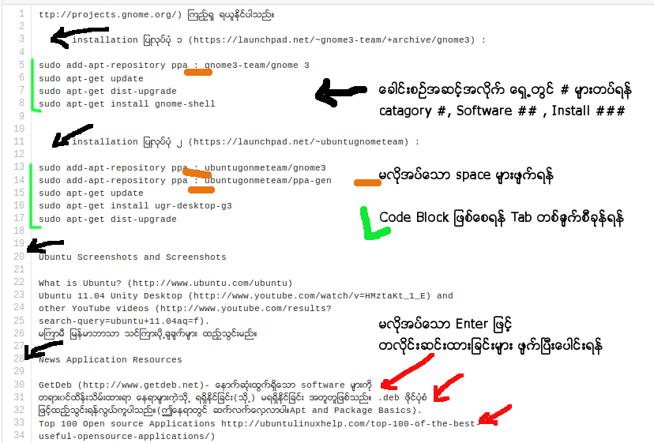

#MarkDown
Ubuntu Wiki မွ Print ထုတ္ထားေသာ စာအုပ္ကို Text ျပန္ေျပာင္းထားျခင္း ျဖစ္သျဖင့္ 

သာမာန္ စိစစ္ရန္ လိုအပ္ခ်က္မ်ားမွာ

စာလုံးေပါင္း အမွားမ်ားပါပါသည္။

URL မ်ားတြင္ Space မ်ားပါေနပါသည္။

Code မ်ားတြင္ Code Block လုပ္ေပးရန္ လိုအပ္ပါမည္။

လိုင္းမ်ားကို မလိုအပ္ပဲ enter ျဖင့္ တစ္ေၾကာင္း ဆင္းထားပါသည္။ ၎တို႔ကို ျပန္ဆက္ၿပီး တစ္ေၾကာင္းတည္း ထားရန္ လိုအပ္ပါသည္။ ePub ႏွင့္ Web Version တြင္ ပိုမို အဆင္ေျပေစရန္ ျဖစ္ပါသည္။

###MarkDown ျဖင့္

Header / Title တပ္ရန္လိုပါသည္။

ေခါင္းစဥ္အတြက္ H1 မွ H6 အထိ # တစ္ခုမွ ေျခာက္ခုထိ အသုံးျပဳႏိုင္သည္။

	#Applications
	##VLC Player
	#### VLC Installation

#Applications
##VLC Player
####VLC Installation

###Terminal တြင္ အသုံးခ်ရမည့္ စာသားမ်ားကို ခြဲျခားေပးရပါမည္။

Code Block အတြက္ စာသားမ်ား ၾကားညွပ္ထားပါက ` အဖြင့္အပိတ္ ျဖင့္ အသုံးျပဳႏုိင္ၿပီး စာပုဒ္လိုက္ဆိုပါက Space ၄ ခ်က္ သို႔မဟုတ္ Tab တစ္ခ်က္ျဖင့္ သုံးႏုိင္သည္။

ဥပမာ

သင့္အေနျဖင့္ Administration အျဖစ္ အသုံးျပဳလိုပါက `sudo` command ကို အသုံးျပဳႏိုင္သည္။ 

	sudo apt-get update
	sudo apt-get upgrade

အေသးစိတ္ကို README.md တြင္ ၾကည့္ရႈႏိုင္ပါသည္။
ျပင္ဆင္ထားၿပီး နမူနာမ်ားကို [u4mm-md](./u4mm-md) တြင္သြားေရာက္ ၾကည့္ရႈေလ့လာႏိုင္သည္။
